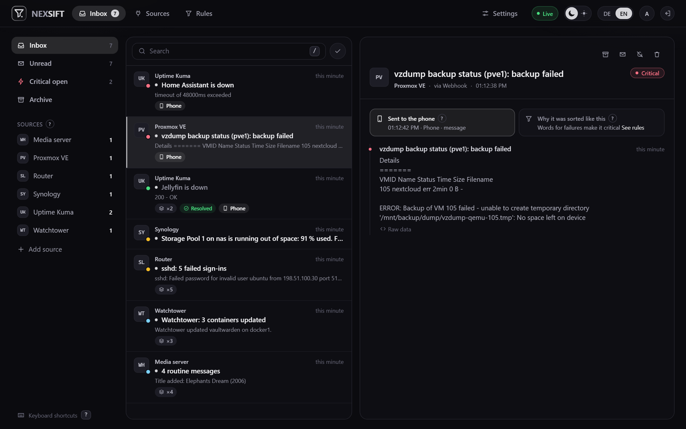
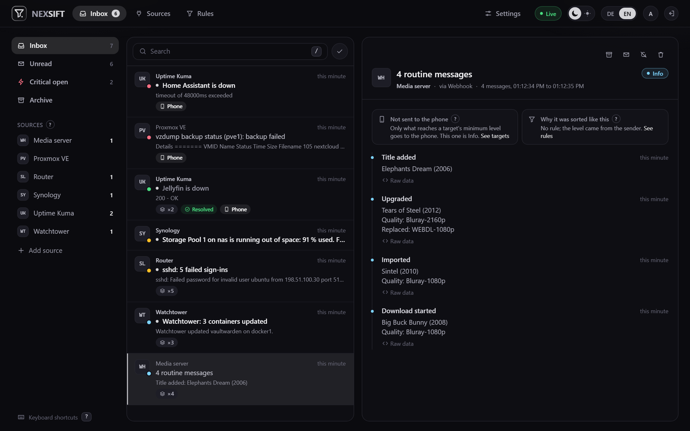
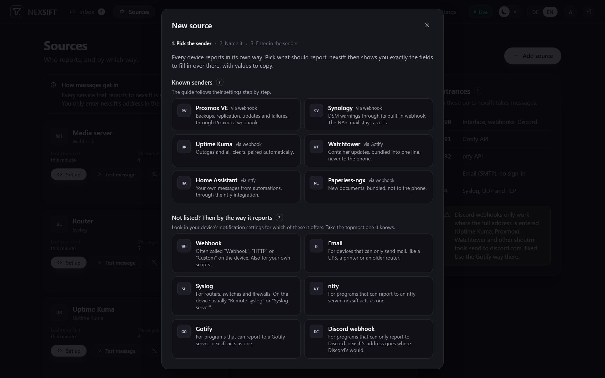
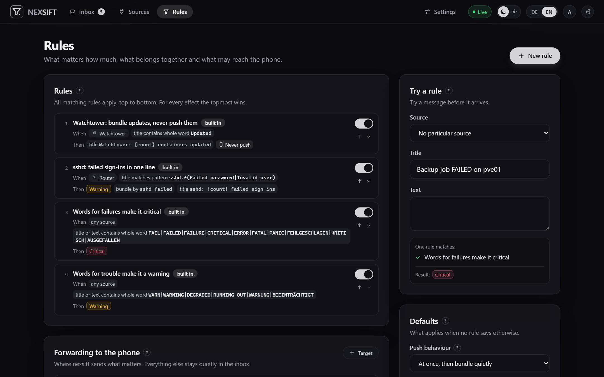

# nexsift

One inbox for everything your homelab has to say. Proxmox, the NAS, Uptime Kuma, Watchtower, the router and
every script report to nexsift instead of to your phone. nexsift sorts what arrives, bundles the noise into
single lines and sends only what matters to the phone: a failed backup at once, a container update never.

Senders need no plugin and no change. nexsift answers like the services they already know: a Gotify server, an
ntfy server, a Discord webhook, a mail server, a syslog server, or a plain webhook.

## Screenshots



*The inbox. Problems on top, each with where it came from, why it is critical and whether it reached the phone.*



*Routine from one source in one line, whatever the titles. Nothing of it rang the phone.*



*Adding a source: pick the sender, and nexsift shows exactly what to enter there, with values to copy.*



*Rules decide level, bundling and push. Try a message against them before it arrives.*

## What it does

- **Many ways in, one inbox.** Each way is its own port, so senders keep the addresses they expect:
  - a webhook for JSON or form posts; `title`, `message` and `priority` work, and so do the field names most
    senders already use (`text`, `body`, `severity`, `level`, `status`, …)
  - a Gotify API (`POST /message`), for Watchtower and everything else built on shoutrrr
  - an ntfy API (`POST /<topic>`), including the subscription Home Assistant's ntfy integration opens
  - Discord webhook addresses, for senders that only know Discord
  - SMTP without sign-in, for a UPS, a printer or an old router that can only send mail
  - syslog over UDP and TCP (RFC 3164 and 5424)
- **Senders it knows by name**, with a step by step setup that follows their own settings page: Proxmox VE,
  Synology DSM, Uptime Kuma (webhook or Discord), Watchtower, Home Assistant and Paperless-ngx. For these nexsift
  pairs outage and all-clear, names the updated containers and groups backups per host. Anything else comes in
  through whichever way it speaks.
- **Unknown senders** knocking on the mail, syslog or ntfy door are listed with what they sent, and become a
  source with one click.
- **Three levels:** info, warning, critical. From what the sender says, from words in the message (FAILED,
  ERROR, DEGRADED, … in English and German, editable), or from your own rules.
- **Bundling without knowing the sender.** All info messages of a source within the bundle window share one line.
  Warnings and critical messages get one line per subject; an open critical problem stays one line until it is
  resolved.
- **All-clears close problems** instead of opening new lines: Uptime Kuma's "up", a successful Proxmox backup
  after a failed one, or anything a rule says.
- **Push to the phone** through ntfy, Gotify, Telegram, Apprise or a webhook, each with a minimum level (critical
  by default) and quiet hours. The first critical message of a subject goes out at once; more of the same are
  counted and summed up once at the end of the window. The all-clear follows quietly.
- **Storm guard:** when many things fail at once, such as a power cut, the phone gets one summary instead of
  twenty pushes. A source that floods (more than 30 messages a minute by default) is counted, not stored.
- **Rules** with conditions on title and text (whole word, contains, regular expression) and effects: level,
  bundling key, bundle title, all-clear, push behaviour, or drop. All matching rules apply, top to bottom.
- **A live inbox** with search, unread, archive and keyboard shortcuts (`?` shows them).
- **One operator account** with a password, optionally OpenID Connect; for authentik there is a one-button setup.
- **Housekeeping:** archived lines go after 30 days, all others after 90, what senders sent verbatim after 7. All
  three are settings.
- German and English. Another language can be uploaded as one JSON file under Settings; for now it is kept in
  the browser that uploaded it.

## Start

```yaml
services:
  nexsift:
    image: ghcr.io/derkezorm/nexsift:latest
    container_name: nexsift
    restart: unless-stopped
    ports:
      - "8490:8000"      # interface, webhooks, Discord-style webhooks
      - "8491:8001"      # Gotify API
      - "8492:8002"      # ntfy API
      - "25:2525"        # SMTP, no sign-in
      - "514:5514/udp"   # syslog
      - "514:5514/tcp"
    volumes:
      - ./data:/data
    environment:
      PUID: 1000
      PGID: 1000
      TZ: Europe/Berlin
      NEXSIFT_PUBLIC_PORTS: "web=8490,gotify=8491,ntfy=8492,smtp=25,syslog=514"
```

```
docker compose up -d
```

Open `http://<your-host>:8490` and create the operator account (a password of at least 12 characters). Then add
the first source; the dialog shows what to enter in the sender. The [docker-compose.yml](docker-compose.yml) in
this repository explains every line.

Remove a port line to close that door. If a host port is taken, use another one on the left and say so in
`NEXSIFT_PUBLIC_PORTS`, so the setup hints show the right numbers.

Put the interface (port 8490) behind a reverse proxy with TLS if you open it beyond your own network. The other
doors are meant for the devices in your network.

### On a Synology

- Find your user's numbers with `id` over SSH and put them into `PUID` and `PGID`. The first administrator is
  often 1026, later users are not.
- DSM puts an access list on folders created in a shared folder, and it only lets the administrators group write.
  nexsift then stops with "the data directory is not writable". Remove the list for the data folder only:
  `sudo synoacltool -del /volume1/docker/nexsift/data`, then `sudo chown -R <uid>:<gid>` on the same folder.
- Port 514 is taken when the Log Center receives logs, port 25 when MailPlus runs. Map another port and say so in
  `NEXSIFT_PUBLIC_PORTS`.

### Behind a reverse proxy

Set two addresses under Settings: the **public address** you type in the browser (`https://nexsift.example.com`),
and the **address for senders at home** (`192.168.1.10`). Syslog, email and the Gotify and ntfy doors do not go
through a proxy, so the setup hints have to send the devices to nexsift directly.

## Where things are stored

Everything lives in `/data`: the SQLite database `nexsift.db` and `secret.key`. Mount it from a local disk, never
from an SMB or NFS share; SQLite's locking does not hold up over network filesystems.

`secret.key` protects the stored secrets: source tokens, push target credentials, the OIDC client secret. Back it
up together with the database.

Forgot the password? In the container: `python -m app.reset_password`.

## Environment

| Variable | Default | Meaning |
|---|---|---|
| `NEXSIFT_DATA_DIR` | `/data` | Data directory |
| `NEXSIFT_SECRET_KEY` | created on first start | Protects the stored secrets; when set, it wins over `secret.key` |
| `NEXSIFT_PUBLIC_URL` | from the request | The address people and senders use to reach nexsift; for the setup hints and the OIDC redirect. The setting under Settings wins when set |
| `NEXSIFT_PUBLIC_PORTS` | the inner ports | The ports as seen from outside, for the setup hints: `web=8490,gotify=8491,ntfy=8492,smtp=25,syslog=514` |
| `NEXSIFT_TRUSTED_PROXIES` | none | Addresses or networks of reverse proxies whose `X-Forwarded-For` is believed, comma separated |
| `NEXSIFT_SESSION_DAYS` | `30` | A browser session ends after this many days |
| `NEXSIFT_COOKIE_SECURE` | `auto` | `on`, `off` or `auto` (from the request or `X-Forwarded-Proto`) |
| `NEXSIFT_LOG_LEVEL` | `INFO` | `DEBUG`, `INFO`, `WARNING` or `ERROR` |
| `NEXSIFT_API_DOCS` | `false` | Serves `/api/docs` and `/api/openapi.json` |
| `NEXSIFT_GOTIFY_PORT`, `NEXSIFT_NTFY_PORT`, `NEXSIFT_SMTP_PORT`, `NEXSIFT_SYSLOG_PORT` | `8001`, `8002`, `2525`, `5514` | Ports inside the container; `0` turns that door off |
| `PUID`, `PGID` | `1000` | Owner of the files in the data directory |

## Security in short

- Passwords are hashed with Argon2id. Ten failed sign-ins in a row lock the account for fifteen minutes.
- Every source has its own token or topic, long enough not to be guessed. Tokens are stored as hashes for the
  check and encrypted for showing the setup again. An unknown token or topic is refused, never created.
- Every changing request of the interface needs the header `X-Requested-By: nexsift`.
- Responses carry a Content Security Policy, `X-Frame-Options: DENY` and friends.
- Links in messages are only made clickable for `http` and `https`.

## Development

```
cd backend && python -m venv .venv && .venv/Scripts/pip install -r requirements-dev.txt
NEXSIFT_WEB_PORT=8490 .venv/Scripts/python -m app.serve
cd frontend && npm ci && npm run dev
```

The frontend on port 5480 proxies `/api` to `http://127.0.0.1:8490` (another address with `NEXSIFT_API`).
Tests: `pytest` in `backend`, `npm test` in `frontend`.

## License

AGPL-3.0.
